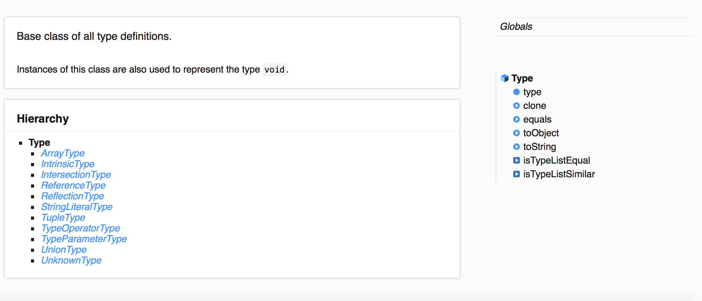
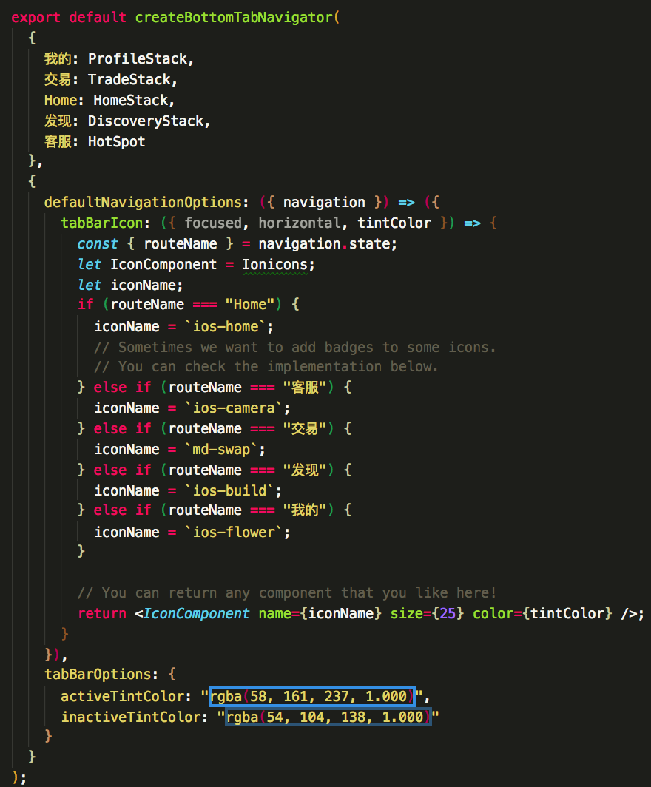
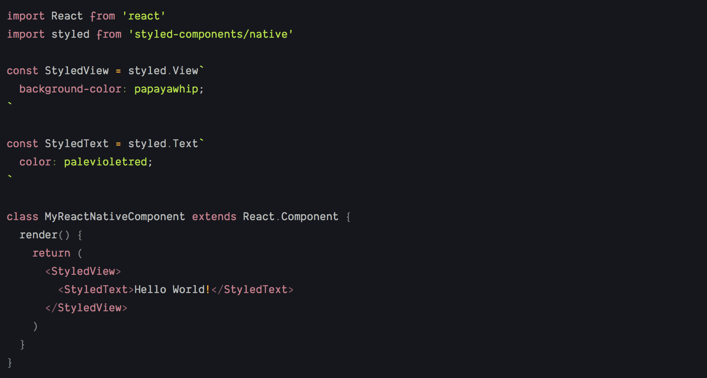

# React-Native开发技术栈 

React-Naitve应用开发的技术概览

---
### 语言选择: TypeScript


  
+++
- 使用Interface和Type来增加类型约束

```javascript
  export interface ILearningCategoryItem {
  name: string;
  imageUrl: string;
  total: number;
  learned: number;
}
```


+++
- TypeDoc生成自动生成技术文档



+++
- 使用React-Native-web 结合docz生成组件说明文档


---
### 文件结构
以GitPoint结构为蓝本


--- 
@snap[west span-50]
#### 底部导航概览

@snapend

@snap[east span-50]
####  页面截图

@snapend

---
### 具体实现页面路由


```javascript
const HomeStack = createStackNavigator({
  Program: {
    screen: MockTrade,
    navigationOptions: () => ({
      header: null
    })
  },
  Home: {
    screen: Home,
    navigationOptions: () => ({
      header: null
    })
  },
  NewComer: {
    screen: NewComer,
    navigationOptions: () => ({
      header: null
    })
  },
  //......
  });

HomeStack.navigationOptions = ({ navigation }) => {
  let tabBarVisible = true;
  return {
    tabBarVisible
  };
};
export default HomeStack;
```

---
### 整个应用State下的分支逻辑组织

以Redux的store为依据(稍后讲到),根据应用的State树的分支来组织页面

---
#### 单个页面逻辑的组织,以登录为例
@snap[west span-70]


-  **login.state.tsx**
-  **login.action.tsx**
-  **login.reducer.tsx**
-  **login.reselect.tsx**
-  **login.ui.tsx**

@snapend

---

### 具体实现的技术
- 以Redux技术为原则组织具体实现,围绕应用State为核心
- 分为数据管理和UI层

---
### 数据管理

+++
  #### Redux技术原则
  
@snap[center span-80]
  - 单一数据源 **应用只有一个存储数据的JS对象**
  - state只读 **只能做Immutable的修改**
  - 使用纯函数进行数据修改 `f(action,prevState)=>nextState`

@snapend

+++ 
 #### 数据管理技术栈涵盖内容

 @snap[center span-80]
  - React-Redux:连接组件和Redux
  - Redux-Saga: 业务流程封装 `requestData:loadingTrue->data->loadingFalse` 
  - Reselect  :  优化性能缓存计算数据 `f(stateBranch,cal(stateBranch))`
  - Ramda.js  :  工具函数
  - Immer.js  :  以mutable的方式来执行Immutable的修改
  - mw1:logger  ` log(prevState)->f(action,prevState)->log(nextState)`
  - mw2: redux-presist  数据持久化
  - Dev-Tools : 调试工具

 @snapend

---
### UI

负责数据展现和表现@color[cyan](**修改应用数据的意图**)

+++
#### 使用的组件编写方法
 
  styled-components

  

+++
#### 使用的组件库

-  React-Native-Elements
-  Native-Base


---
### 完成!