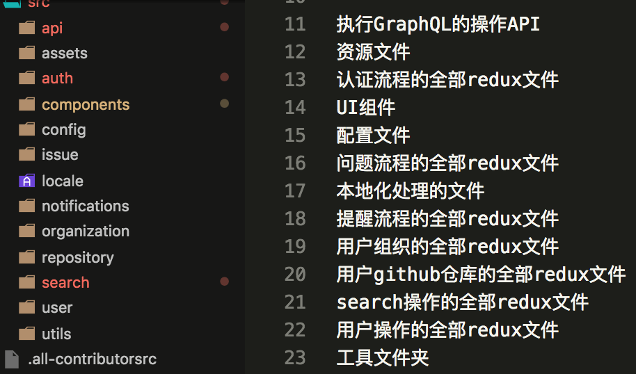
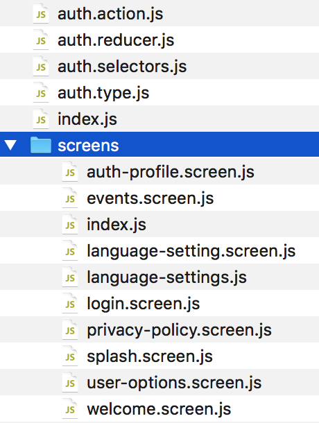

# React-Native 开发技术栈

React-Naitve 应用开发的技术概览

---

### 语言选择: TypeScript

+++
对于应用,根据 UI 原型图定义页面的数据结构


+++

- 使用 Typescript 的 Interface 和 Type 来增加类型约束

```typescript
export interface ILearningCategoryItem {
  name: string;
  imageUrl: string;
  total: number;
  learned: number;
}

type CardProps = {
  title: string;
  paragraph: string;
};
```

+++

```typescript
const learningLevelData: ILeanringCategoryItem[] = [
  {
    name: "Food",
    imageUrl: require("../../assets/learning/page1_icon6.png"),
    total: 3,
    learned: 3
  },
  {
    name: "Animals",
    imageUrl: require("../../assets/learning/page1_icon2.png"),
    total: 5,
    learned: 3
  }
];
```

+++

```typescript
type CardProps = {
  title: string;
  paragraph: string;
};
export const Card = ({ title, paragraph }: CardProps) => (
  <aside>
    <h2>{title}</h2>
    <p>{paragraph}</p>
  </aside>
);

const el = <Card title="Welcome!" paragraph="To this example" />;
```

+++

```typescript
export default class LanguageLearningscreen extends React.Component<
  LanguageLearningscreenProps,
  LanguageLearningscreenState
> {
  constructor(props: LanguageLearningscreenProps) {
    super(props);
    this.state = {
      learningLevelData: learningLevelData
    };
  }
  render(){
      return Component
  }
```

+++

- TypeDoc 生成自动生成技术文档
  

+++

- 使用 React-Native-web 结合 docz 生成组件说明文档
  

---

#### 文件结构

以 GitPoint 结构为蓝本
使用 React-Navigation 组件提供的方法组织:

---

整体文件结构


---

业务结构实现文件


---

@snap[west span-50]

#### 底部导航概览


@snapend

@snap[east span-50]

#### 页面截图


@snapend

---

### 具体实现页面路由

```javascript
const HomeStack = createStackNavigator({
  Program: {
    screen: MockTrade,
    navigationOptions: () => ({
      header: null
    })
  },
  Home: {
    screen: Home,
    navigationOptions: () => ({
      header: null
    })
  },
  NewComer: {
    screen: NewComer,
    navigationOptions: () => ({
      header: null
    })
  }
  //......
});

HomeStack.navigationOptions = ({ navigation }) => {
  let tabBarVisible = true;
  return {
    tabBarVisible
  };
};
export default HomeStack;
```

---

### 整个应用 State 下的分支逻辑组织

以 Redux 的 store 为依据(稍后讲到),根据应用的 State 树的分支来组织页面

---

单个页面逻辑的组织,以登录为例

- login.state.tsx
- login.actionType.tsx
- login.action.tsx
- login.reducer.tsx
- login.selector.tsx
- login.ui.tsx

---

### 具体实现的技术

- 以 Redux 技术为原则组织具体实现,围绕应用 State 为核心
- 分为数据管理层和 UI 层
- 数据管理层负责处理应用的 state
-

---

### 数据管理

+++

#### Redux 技术原则

@snap[center span-80]

- 单一数据源 **应用只有一个存储数据的 JS 对象**
- state 只读 **只能做 Immutable 的修改**
- 使用纯函数进行数据修改 `f(action,prevState)=>nextState`

@snapend

+++

#### 数据管理技术栈涵盖内容

- React-Redux:连接组件和 Redux
- Redux-Saga: 业务流程封装 `requestData:loadingTrue->data->loadingFalse`
- Reselect : 优化性能缓存计算数据 `f(stateBranch,cal(stateBranch))`
- Ramda.js : 工具函数
- Immer.js : 以 mutable 的方式来执行 Immutable 的修改
- mw1:logger `log(prevState)->f(action,prevState)->log(nextState)`
- mw2: redux-presist 数据持久化
- Dev-Tools : 调试工具

---

### UI

负责数据展现和@color[cyan](**表现修改应用数据的意图**)---意图

+++

#### 使用的组件编写方法

styled-components


+++

#### 使用的组件库

- React-Native-Elements
- Native-Base

---

### 完成!
