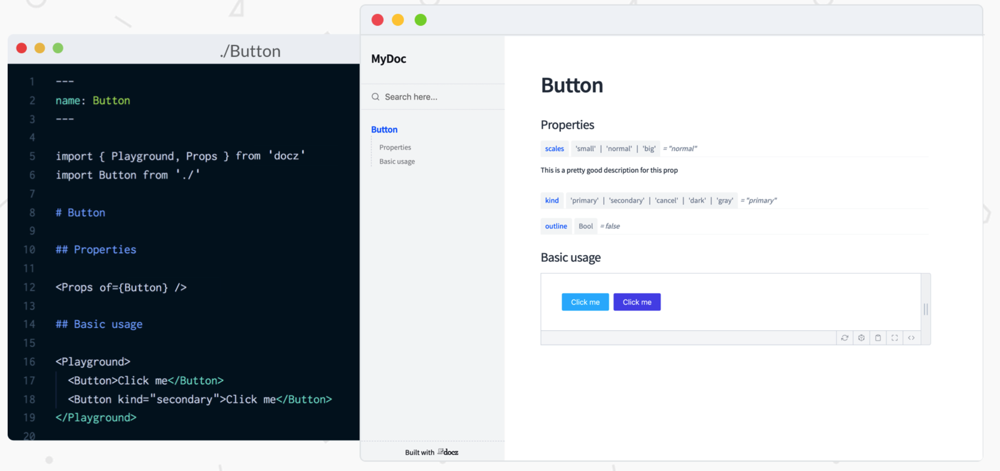

# React-Native开发技术栈 

React-Naitve的技术概览

---
### 语言选择: TypeScript


  
+++
- 使用Interface和Type来增加类型约束

```javascript
  export interface ILearningCategoryItem {
  name: string;
  imageUrl: string;
  total: number;
  learned: number;
}
```


+++
- TypeDoc生成自动生成技术文档


+++
- 使用React-web结合docz生成组件说明文档


---
### 文件结构
以GitPoint结构为蓝本


--- 
@snap[west span-50]
#### 底部导航概览

@snapend

@snap[east span-50]
####  页面截图

@snapend

---
### 具体实现页面路由


```javascript
const HomeStack = createStackNavigator({
  Program: {
    screen: MockTrade,
    navigationOptions: () => ({
      header: null
    })
  },
  Home: {
    screen: Home,
    navigationOptions: () => ({
      header: null
    })
  },
  NewComer: {
    screen: NewComer,
    navigationOptions: () => ({
      header: null
    })
  },
  //......
  });

HomeStack.navigationOptions = ({ navigation }) => {
  let tabBarVisible = true;
  return {
    tabBarVisible
  };
};
export default HomeStack;
```